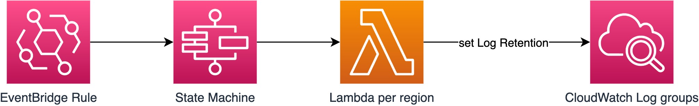

# Patch Log Groups Multi Region

CDK construct to set Log Retention on CloudWatch Log Groups over multiple AWS Regions. Usefull to fullfill compliance requirements also for dynamically generated Log Groups worldwide (e.g. by Lambda@Edge).



## Getting started

### Installation

npm:

```shell
npm install --save patch-log-group-multi-region
```

yarn:

```shell
yarn add patch-log-group-multi-region
```

### Usage

Add the construct to your stack like in the following example:

```typescript
new PatchLogGroups(stack, "PatchLogGroups", {
  regions: ["eu-west-1", "eu-central-1"],
  schedule: aws_events.Schedule.cron({
    minute: "0",
    hour: "0",
  }),
});
```

### Additional configuration options

```typescript
new PatchLogGroups(stack, "PatchLogGroups", {
  regions: ["eu-west-1", "eu-central-1"], // List of AWS regions in which the function should run
  schedule: aws_events.Schedule.cron({ minute: "0", hour: "0" }), // Schedule event for the event rule
  retentionInDays: 30, // Number of days to which log retention should be set.
  logGroupNamePrefix: "aws/lambda", // Prefix for log group names that should be effected.
  logsResources: [
    "arn:aws:logs:eu-west-1:0123456789:log-group:*:*",
    "arn:aws:logs:eu-central-1:0123456789:log-group:*:*",
  ], // Resource ARNs to add to the Lambda execution role policy statement.
});
```
